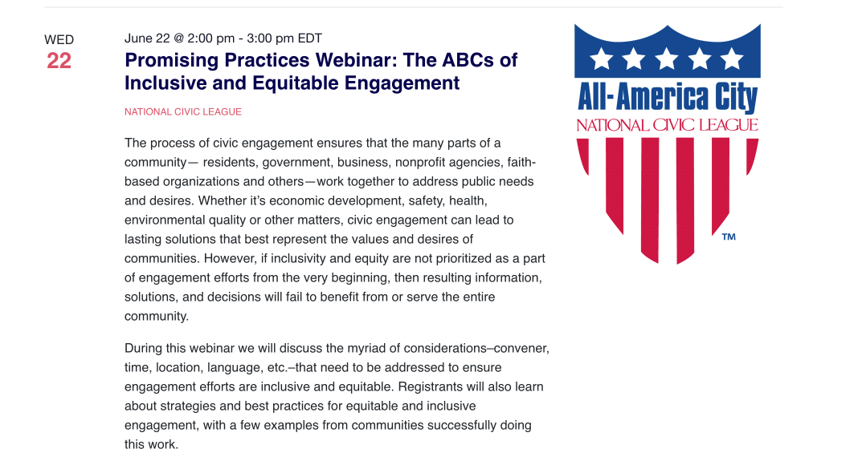

## User Journey - Most Frequent Landing Page

This is the page that had the highest user acquisitions for Q2 2022. All of those hits were June 1 – June 14, and came from paid social media advertising through a pilot program. For the 5.6K sessions there was virtually 100% drop-off, with only one of these users clicking through to a second Citizen Connect page.

#### What does this tell us?

Driving traffic to the website is important - but to make those visits count, it's necessary that we make it more enticing and/or easier for them to stay on the site and become comfortable using it. 

When the users came to this event page from an ad, if they clicked through to the member registration page, that is a drop-off. However, it's possible that the user journey would be enhanced if the registration link opened in a second window. That way, the user could explore the link but not lose literal sight of Citizen Connect as well. Then, if they are not interested in the event, they may find it convenient to continue to explore the rest of the Citizen Connect website.

## Alternative Journey - America Talks Landing Page

This is the second highest user acquisitions for Q2 2022, and similar to the top event, of the 1.5K sessions, there was 100% drop-off of users.

There were 4.3K users that came to the America Talks landing page, but there is another very high 93.8% drop off rate from the site.

#### What does this tell us?

Since the acquisition session started here as categorized as "Other" acquisitions in Google Analytics, it's unclear where they originated from. Since America Talks is a primary member event for Citizen Connect, it is likely that these visitors used the page as a portal and likely 'clicked through' via the "Sign up Now" button, leading to the high drop-off rate.

However, the ability to paint an accurate user journey would require a more robust way of tracking these links and working with partners to gauge traffic.

