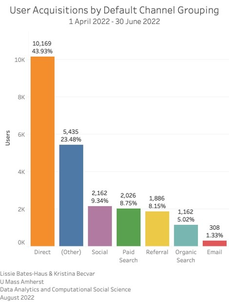
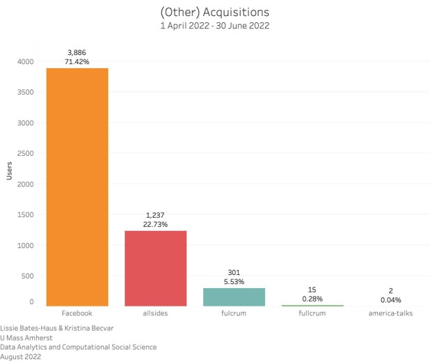
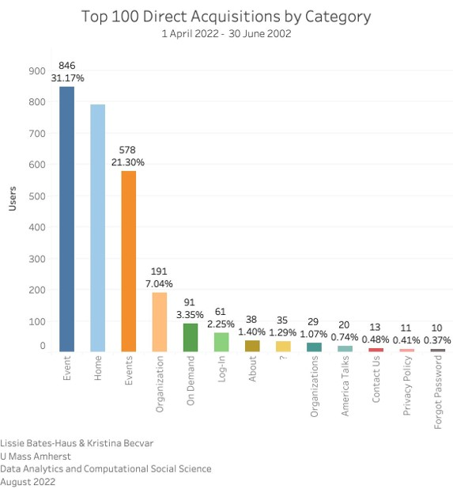
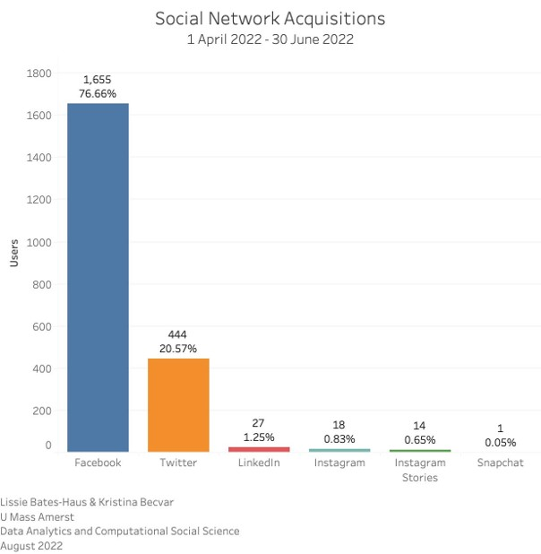
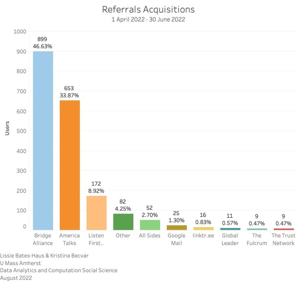
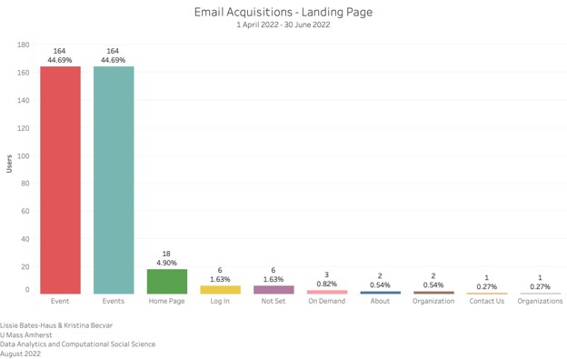
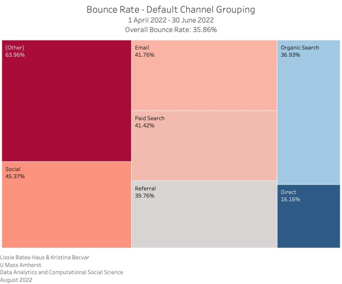
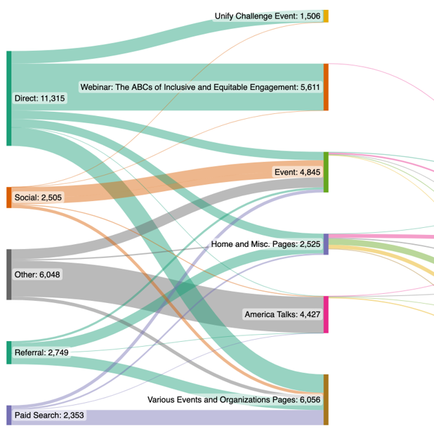

## Where Visitors Are Coming From

### Breaking Down the 'Other'

## What Visitors Are Looking At

## Social Media Acquisitions

## Acquisitions by Referral

## Where do Email Acquisitions Land?

## Profile of Bounce Rate

## Website User Behavior Flow

