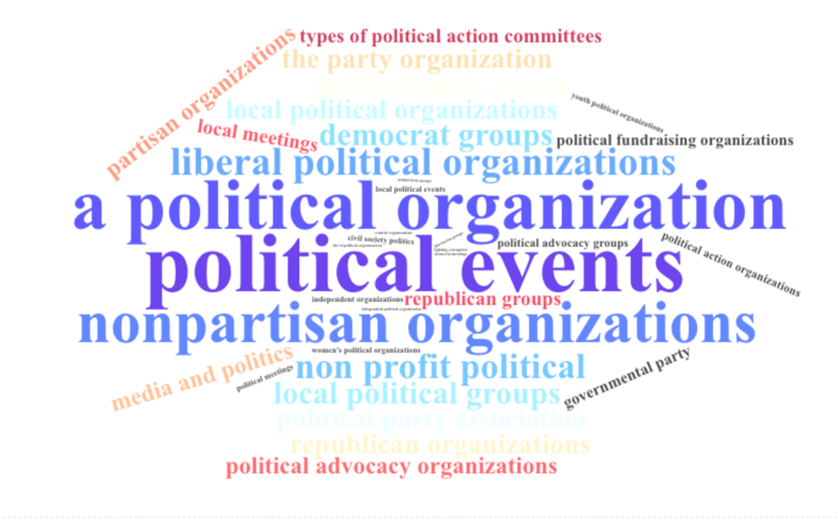
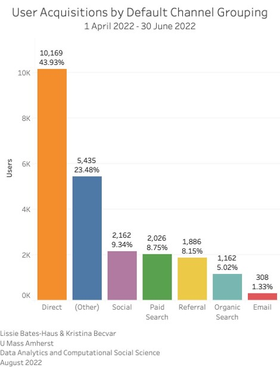
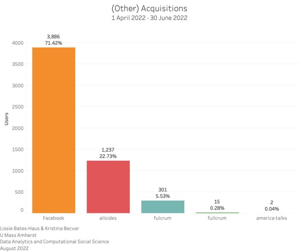
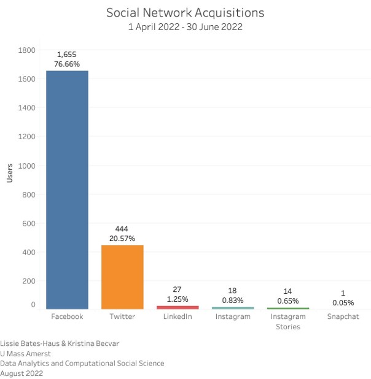
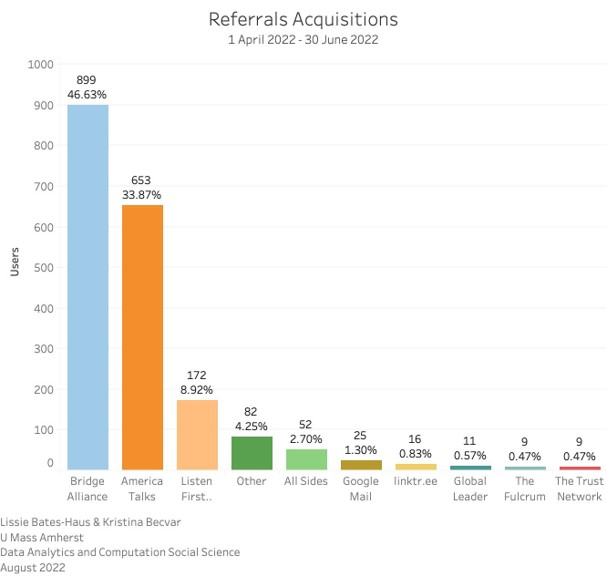
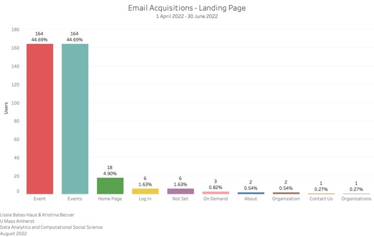
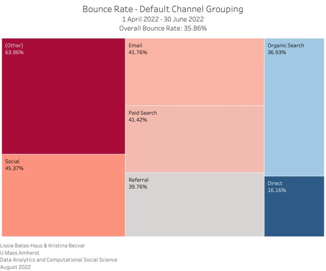
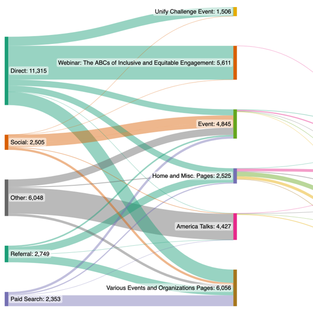

## Finding Citizen Connect

### Search Terms

The frequency of search terms used on Google to find citizen Connect are represented here size in a word cloud.

Our analytic research was primarily digging deep into the Google Analytics data as well as the Social Media analytics provided by each of the platforms and the social CRM tool Sprout Social.

## Where Visitors Are Coming From

#### Analysis

Notably, the 'direct' category is significantly higher.
In general, this can happen because that 'direct' category is Google’s "catch-all". If a session can’t be attributed, then Google Analytics will add it to 'direct'.

As we learned from the A/B pilot testing conducted prior to our project, this is a known issue with Citizen Connect's website, so the tracking cannot be fully analyzed. However, since we know from that report that this is the reason for the high 'direct' traffic, we are able to understand the reason for the anomoly for this time period.

### Breaking Down the 'Other'

#### Analysis

It is noteworthy that the largest category of 'other' from the acquisition report indicates traffic from Facebook. It is not clear where this traffic is originating, since traffic from Facebook should be included in the Social Media category. This is another Citizen Connect tracking question to tackle with the website provider.

Another noteable piece of this analysis is that there are two different indicators with different spellings of 'fulcrum', with one spelled 'fullcrum'. This is another piece of tagging that should be addressed going forward for clarity.

## Social Media Acquisitions

#### Analysis

Clearly, Facebook is the largest driver of traffic to Citizen Connect among social media channels. It is likely that the 3,886 user acquisitions indicated as "Facebook" in the 'other' section should be counted here as well, which would make the proportion even greater in the Facebook column.

The presence on LinkedIn is small, so the engagement there is reasonable to expect. The Instagram engagement is reasonable as well. In addition to having a small presence in followers on Instagram, the social media plan has not included a linktree or similar traffic management tool. Links in Instagram posts are not clickable, so none of the posts have been able to generate traffic. Since the profile link is to the primary page only, there is little incentive to engage there. A linktree directing traffic to the event/content being promoted could help drive this engagement higher.

## Acquisitions by Referral

#### Analysis

8.26% of total acquisitions for the time period analyzed came from referrals. Referrals are from direct links outside of search engine or otherwise tracked results. Of these referrals, the largest proportion came from Bridge Alliance, followed by America Talks, which tracks with the Citizen Connect involvement level with both organizations.

The presence of the Fulcrum as a referral source here in addition to in the 'other' acquisitions spelled two ways leads us to believe that the other acquisitions were from campaigns, and the referrals are coming from the Fulcrum directly.

## Where do Email Acquisitions Land?

#### Analysis

This indicator is of the acquisitions coming from links embedded in emails, likely the Citizen Connect newsletter as the primary driver. The top hits are 'Event' and 'Events', which seem to be differentiated by whether it is the man 'Events' aggregation page or an individual 'Event' page.

## Profile of Bounce Rate

#### Analysis

A 'bounce' is when someone lands somewhere on the site and leaves without clicking through to  anything. In this analysis, the 'other' is driven primarily by the 'other' Facebook result (87.05% bounce rate) and "fullcrum" (61.90% bounce rate).

## Website User Behavior Flow

#### Analysis

As a way of beginning to look at the user journey, the website user behavior flow is important to visualize as another method of trying to understand the data. In this graphic, the user behavior is tracked by acquisition type in the first stage, and landing page in the second stage. Beyond the second stage is the flow of conversion to further engagement on the site.

