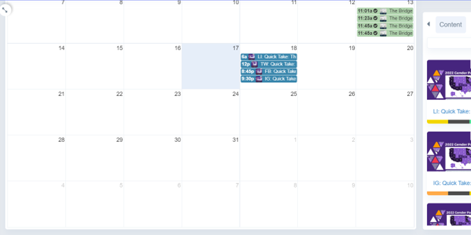
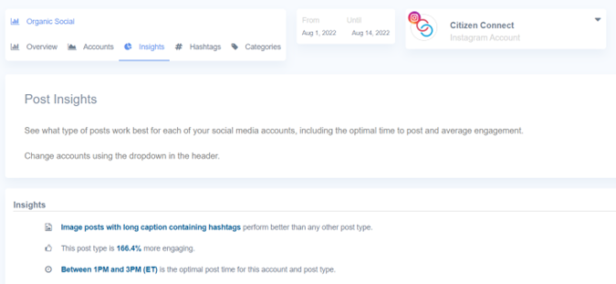
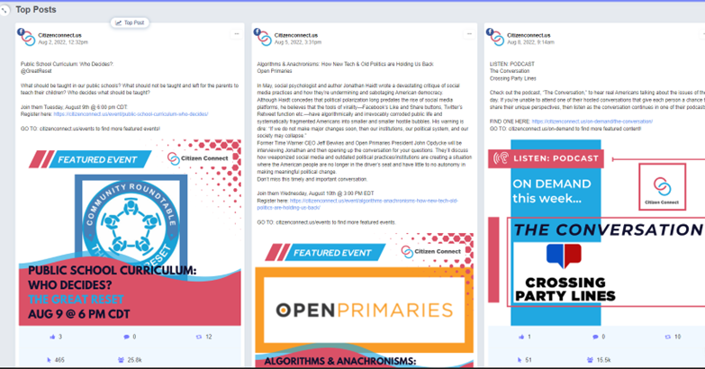

### Building upon the existing member communications plan is essential to further Citizen Connect's work in community building and to increase engagement with members.

---

## Background

### Citizen Connect has a large number of organizations, but not a large number of interactions happening on social media. Some of this is due to the relative youth of the organization. But no growth will happen at scale without a solid internal alignment with the rest of the Bridge Alliance Education Fund initiatives.

## Results Uncommunicated

### The "wins" that Citizen Connect experiences with their social media amplification is currently not being communicated to the members. This is a missed opportunity. However, it is difficult to make this communication happen due to the silo effect of having a lot of work with multiple staffers across initiatives.

### Further, there is a barrier to communication because the current Social Media scheduling and CRM tool, Sprout Social, is costly and offers minimal licenses, so that everyone on the communications team cannot access the same information in a timely manner. 

## Possible Solution

### There are alternatives to Sprout Social that would help to get the team on the same page and to communicate easily with members. One of those is outlined below.

---

## Cloud Campaign

### Cloud Campaign is an agency-focused software that does much of the same work that Sprout Social does, but since it is intended for agencies managing multiple 'brands', it may be suitable for the Bridge Alliance Education Fund and the 4 separate initiatives.

#### Brands: The agency subscription, which is heavily discounted for non-profits, allows for up to 5 "brands'.

#### Users: There are unlimited users for the account, and they can be assigned access to one or more of the initiatives with levels of access.

#### Integrations: The software integrates with Canva, so work created there can be saved directly to Cloud Campaign. In addition, there is integrations with Google Drive folders and Slack for notifications.

#### Approval and Workflow:  With the access control comes approval workflows; so there can be creative contributions from multiple staffers and contributors that can be submitted for approval to the workflow.

#### Algorithm Sensitivity: When content is added to the content library, it can be set up for a specific schedule, or 'dragged' onto the day being scheduled, and the software will post the content on the indicated channels at the optimal times.

#### There is also analysis of the top performing types of posts and feedback on when each type of post performs well

#### White Labeling: Because the platform is primarily agency-based, reports are white-labeled so that any report on a member can be tagged, and a professional report can be generated to provide the member giving them an overview of their content's social media performance for a given time frame.

#### Reporting: There is a very intuitive and easy to access dashboard for any combination of accounts a user can access and chooses to examine.

