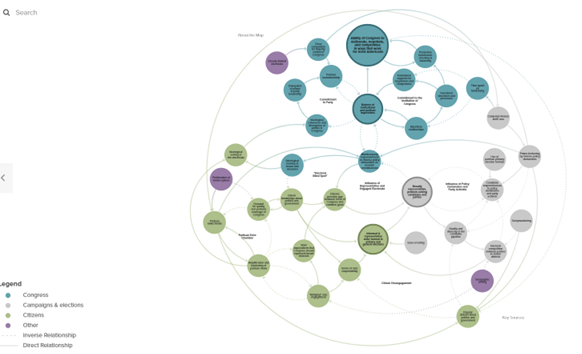

### Putting a survey in action to understand a sample of American citizens and how they interact with Citizen Connect messaging and offerings will help better understand how to communicate the organizational mission and amplify member initiatives.

---

## Background

### A large amount of Americans are looking for a different political option than the polarized 2-party system

## Research Direction

### There is a growing field of social and political network research demonstrating the "strength of weak ties." (Granovetter, 1973) This theory that information from peripheral connections can be more important because it is outside the type of echo-chamber that the stronger connections can create.

### Because of the combination of Americans looking outside the two-party structure and the opportunity to reach those who are on the periphery of their identified "party identity", it is worthwhile to do more specific research into what messages will resonate with this group of citizens that Citizen Connect is trying to reach.

## Survey

### In the course of developing a member amplification plan for Citizen Connect, it is important to find data supporting where to best place our amplification spend and direction. This could look like a a survey in the field or formal focus group research.

#### Survey Companies

##### YouGov

One option is conducting a survey through YouGov, a firm that is used by UMASS Amherst Department of Social and Behavioral Sciences, and has conducted polls for a variety of clients, including the Economist and CBS News. YouGov relies on cutting edge statistical techniques to recruit survey respondents online and produce a representative sample of the target population.

##### MTurk/Amazon

Another option is to conduct a survey using Qualtrics survey design software and implemented through MTurk. MTurk is a service through Amazon for utilizing individuals they have identified to complete work, including survey work.

##### Ipsos/Knowledge Panels

KnowledgePanel is the oldest and largest probability-based online panel in the U.S.—with about 60,000 members. Built on a foundation of address-based sampling (ABS), KnowledgePanel provides a statistically valid representation of the U.S. population as well as many under-researched and often harder-to-reach populations

## Focus Groups

### Many of the studies that have been done on political engagement were completed before COVID. Unfortunately, the COVID pandemic aligned with a divisive presidency, charged social and medial debates, and tribalism in the 2020 presidential election. There is reason to dig in to how the absence of the weak ties that increased exposure to those on our social periphery during COVID has increased the polarization and closure to uniting civic ideas.

### In addition, the "strength of weak ties" theories have been shown in recent studies to need re-examining because of the way the social media has changed the ways people connect and identify with social groups. (Krämer, et al, 2021) There is reason to hope that messages among homogenous groups can increase knowledge and reduce polarization (Becker, et al, 2017). There is also research to indicate that exposing people to opposing views on social media increase polarization. (Bail, at al, 2018) But the reality is likely more nuanced, and dependent on our specific audience, topics, and social timing (Wiedermann, et al, 2020)

---

## There is no clear, established, path to understanding social media behavior, so targeted research to support Citizen Connect goals is an important step in future growth.

## One thing that is clear is that there is no linear solution to citizen engagement. It is a complex network that will take time and testing to get right.([Link to HP Foundation Network Research, "The Madison Initiative"](https://hewlettfoundation.kumu.io/hewlett-foundations-the-madison-initiative))

*Bail, C. A., Argyle, L. P., Brown, T. W., Bumpus, J. P., Chen, H., Hunzaker, M. F., ... & Volfovsky, A. (2018). Exposure to opposing views on social media can increase political polarization. Proceedings of the National Academy of Sciences, 115(37), 9216-9221."*

*Becker, J., Brackbill, D., & Centola, D. (2017). Network dynamics of social influence in the wisdom of crowds. Proceedings of the national academy of sciences, 114(26), E5070-E5076.*

*Granovetter, M. S. (1973). The strength of weak ties. American journal of sociology, 78(6), 1360-1380.*

*Krämer, N. C., Sauer, V., & Ellison, N. (2021). The Strength of Weak Ties Revisited: Further Evidence of the Role of Strong Ties in the Provision of Online Social Support. Social Media + Society.*

*Wiedermann, M., Smith, E.K., Heitzig, J. et al. A network-based microfoundation of Granovetter’s threshold model for social tipping. Sci Rep 10, 11202 (2020).* 

